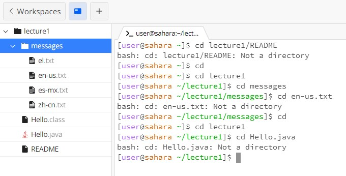
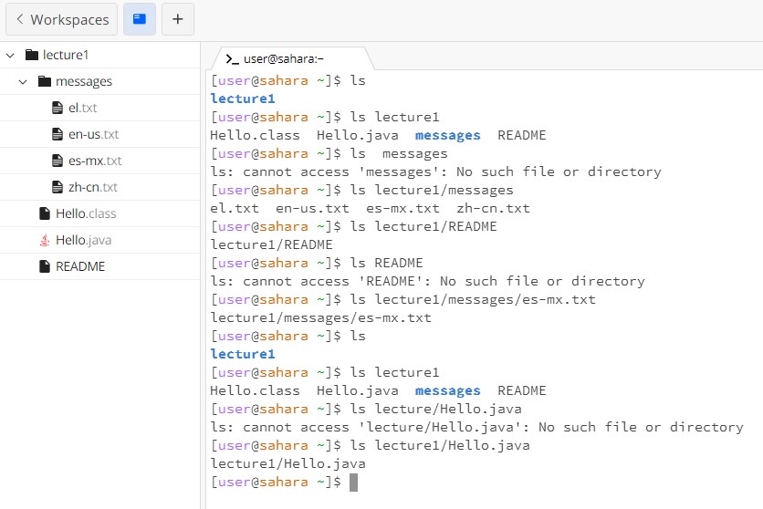
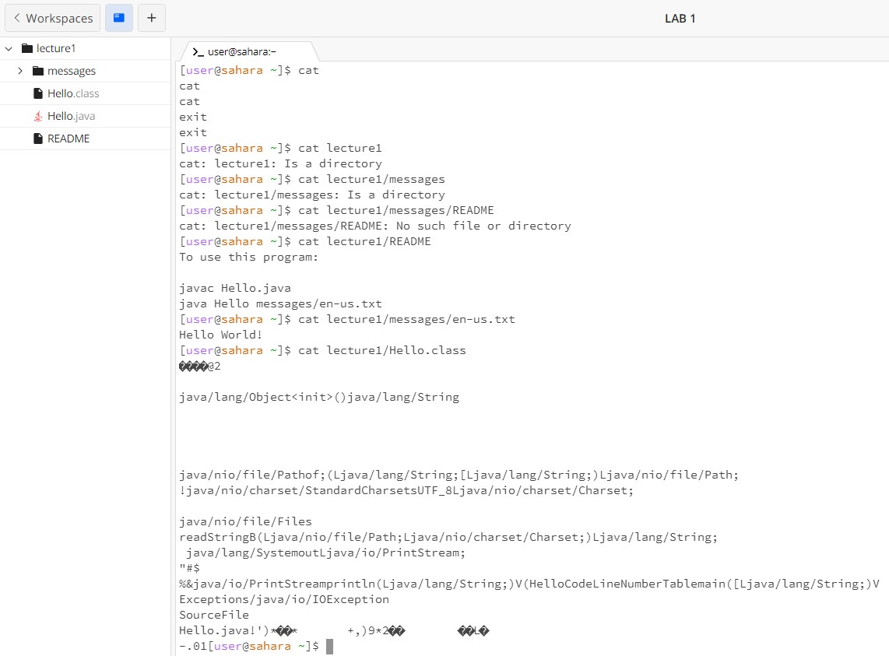

# **Lab Report 1 - Remote Access and FileSystem (Week 1)**

### *cd* Command

1. ## **Example using the command with no arguments.**
   *cd* without an argument leads me back to the Home directory (out of any files that I opened)
2. ## **Example using the command with a path to a directory as an argument.**
   *cd* with a path to a directory allows me to enter a folder.
   Must enter the main folder to access sub-folders.
   Cannot access *messages* folder before *lecture1* folder as the *lecture1* folder contains *messages* folder.
   i.e. *lecture1/messages*
3. ## **Example using the command with a path to a file as an argument.**
   *cd* cannot be used with files, only directorys, with error message:

   > Hello.java; Not a directory as an error message
   
### *ls* Command

1. ## **Example using the command with no arguments.**
   The *ls* without an argument shows the files and directories, in this case just
   > lecture1
2. ## **Example of using the command with a path to a directory as an argument.**
     The *ls* used with a path to a directory as an argument lists all thr contents of the directory.      It is notable that the name of files are in a blue bold.
3. ## **Example of using the command with a path to a file as an argument.**
   The *ls* command with a path to a file as an argument shows its location, proving it is in that directory.
   You cannot name it by itself you must name the directory before the file or you will get an error message.

### *cat* Command

1. ## **Example using the command with no arguments.**
   The *cat* command without any arguments will change the way you type into the terminal, simply saving whatever you enter. To exit this mode, do CTRL+D.
2. ## **Example of using the command with a path to a directory as an argument.**
  The *cat* command with a path to a directory as an argument will confirm that it is a directory.

3. ## **Example using the command with a path to a file as an argument.**
   The *cat* command will display the content of the file, reading any text file. 
