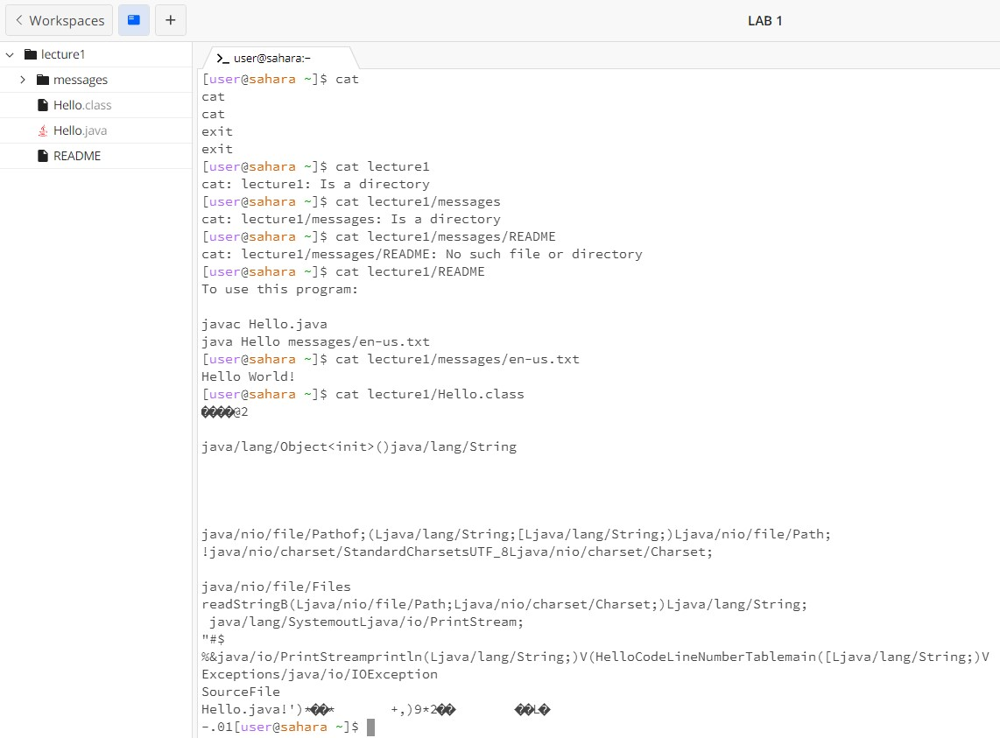

# **Lab Report 1 - Remote Access and FileSystem (Week 1)**

### *cd* Command

1. # *Example using the command with no arguments.*
   *cd* changes the current working directory to the user's home directory.
   Without argument this is just
   > /home
3. # *Example using the command with a path to a directory as an argument.*
   *cd* changes the current working directory to the specified director making that the current working directory.
   Must enter the main folder to access sub-folders.
   Cannot access *messages* folder before *lecture1* folder as the *lecture1* folder contains *messages* folder.
   i.e. *lecture1/messages changes the working directory to /home/lecture1/messages*
4. # *Example using the command with a path to a file as an argument.*
   *cd* cannot be used with files, only directorys, with error message:

   > Hello.java; Not a directory as an error message
   
### *ls* Command

1. # *Example using the command with no arguments.*
   The *ls* without an argument shows files and directories in the current working directory. The current working directory is /home
   > lecture1 
2. # *Example of using the command with a path to a directory as an argument.*
     The *ls* used with a path to a directory as an argument lists all thr contents of the directory. It is notable that the name of directories are in a blue bold.
3. # *Example of using the command with a path to a file as an argument.*
   The *ls* command with a path to a file as an argument shows its location, proving it is in that directory.
   You cannot name it by itself you must name the directory before the file or you will get an error message.
   If already in the file, you do will not receive the same error message for not providing the full path.
   i.e.
   > cd lecture1
   > ls README
   in the working directory /home/lecture1 produces
   > README
### *cat* Command

1. # *Example using the command with no arguments.*
   The *cat* command without any arguments will change the way you type into the terminal, simply saving whatever you enter. To exit this mode, do CTRL+D.
2. # *Example of using the command with a path to a directory as an argument.*
  The *cat* command with a path to a directory as an argument will confirm that it is a directory. This is considered an error as the command is not made for directories, but for files.  

3. # *Example using the command with a path to a file as an argument.*
   The *cat* command will display the content of the file, reading any text file. The cat command doesn't change the working directory, but to read it youm must either *cd* into a directory or manually type the full directory.

